# No-RAG & Advanced RAG Bot 아키텍처 문서

이 문서는 프로젝트의 전체 구조, 컴포넌트 관계, 데이터 흐름을 시각적으로 설명합니다.

---

## 목차

1. [프로젝트 개요](#1-프로젝트-개요)
2. [전체 시스템 아키텍처](#2-전체-시스템-아키텍처)
3. [No-RAG Bot 상세](#3-no-rag-bot-상세)
4. [Advanced RAG Bot 상세](#4-advanced-rag-bot-상세)
5. [문서 인덱싱 상세](#5-문서-인덱싱-상세)
6. [검색 모드별 흐름도](#6-검색-모드별-흐름도)
7. [클래스 다이어그램](#7-클래스-다이어그램)
8. [데이터 흐름](#8-데이터-흐름)
9. [외부 의존성](#9-외부-의존성)

---

## 1. 프로젝트 개요

이 프로젝트는 문서 기반 Q&A를 위한 두 가지 접근 방식을 제공합니다:

| 봇 | 설명 | 적합한 문서 크기 |
|---|---|---|
| **No-RAG Bot** | 전체 문서를 컨텍스트로 사용 | 소규모 (~100페이지) |
| **Advanced RAG Bot** | 하이브리드 검색 + 리랭킹 | 대규모 (100~500페이지) |

---

## 2. 전체 시스템 아키텍처

### 2.1 고수준 시스템 구조

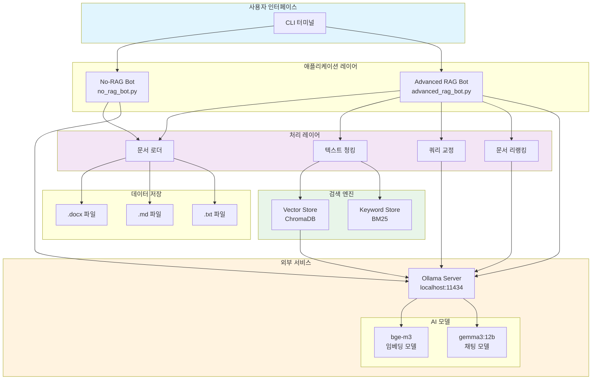
```mermaid
flowchart TB
    subgraph USER["사용자 인터페이스"]
        CLI[CLI 터미널]
    end

    subgraph APPS["애플리케이션 레이어"]
        NRB[No-RAG Bot<br/>no_rag_bot.py]
        ARB[Advanced RAG Bot<br/>advanced_rag_bot.py]
    end

    subgraph PROCESSING["처리 레이어"]
        DOC[문서 로더]
        CHUNK[텍스트 청킹]
        QC[쿼리 교정]
        RR[문서 리랭킹]
    end

    subgraph RETRIEVAL["검색 엔진"]
        VS[Vector Store<br/>ChromaDB]
        KS[Keyword Store<br/>BM25]
    end

    subgraph EXTERNAL["외부 서비스"]
        OLLAMA[Ollama Server<br/>localhost:11434]
        subgraph MODELS["AI 모델"]
            EMB[bge-m3<br/>임베딩 모델]
            CHAT[gemma3:12b<br/>채팅 모델]
        end
    end

    subgraph STORAGE["데이터 저장"]
        DOCX[.docx 파일]
        MD[.md 파일]
        TXT[.txt 파일]
    end

    CLI --> NRB
    CLI --> ARB

    NRB --> DOC
    ARB --> DOC
    ARB --> CHUNK
    ARB --> QC
    ARB --> RR

    DOC --> DOCX
    DOC --> MD
    DOC --> TXT

    CHUNK --> VS
    CHUNK --> KS

    VS --> OLLAMA
    QC --> OLLAMA
    RR --> OLLAMA
    NRB --> OLLAMA
    ARB --> OLLAMA

    OLLAMA --> EMB
    OLLAMA --> CHAT

    style USER fill:#e1f5fe
    style EXTERNAL fill:#fff3e0
    style RETRIEVAL fill:#e8f5e9
    style PROCESSING fill:#f3e5f5
```

### 2.2 두 봇의 아키텍처 비교

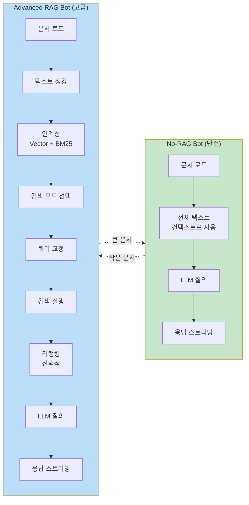
```mermaid
flowchart LR
    subgraph NO_RAG["No-RAG Bot (단순)"]
        direction TB
        A1[문서 로드] --> A2[전체 텍스트<br/>컨텍스트로 사용]
        A2 --> A3[LLM 질의]
        A3 --> A4[응답 스트리밍]
    end

    subgraph ADV_RAG["Advanced RAG Bot (고급)"]
        direction TB
        B1[문서 로드] --> B2[텍스트 청킹]
        B2 --> B3[인덱싱<br/>Vector + BM25]
        B3 --> B4[검색 모드 선택]
        B4 --> B5[쿼리 교정]
        B5 --> B6[검색 실행]
        B6 --> B7[리랭킹<br/>선택적]
        B7 --> B8[LLM 질의]
        B8 --> B9[응답 스트리밍]
    end

    NO_RAG -.->|"작은 문서"| ADV_RAG
    ADV_RAG -.->|"큰 문서"| NO_RAG

    style NO_RAG fill:#c8e6c9
    style ADV_RAG fill:#bbdefb
```

---

## 3. No-RAG Bot 상세

### 3.1 No-RAG Bot 시퀀스 다이어그램

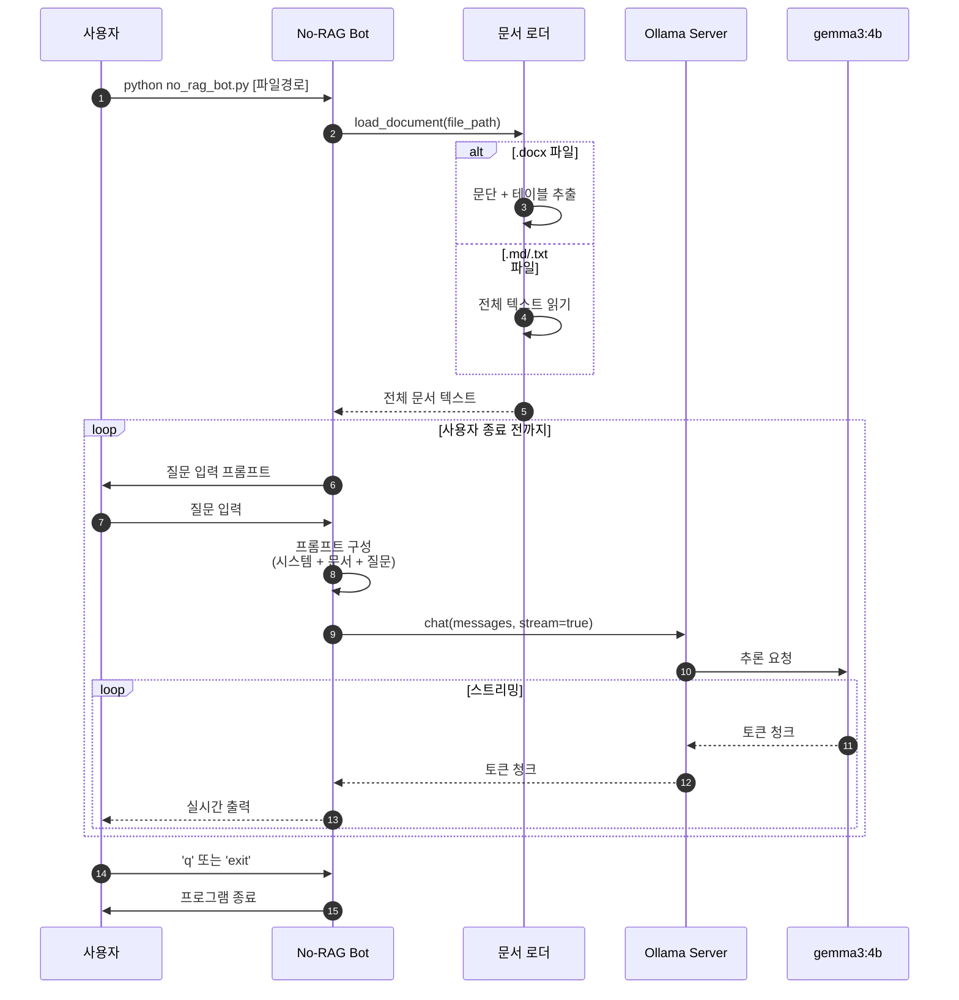
```mermaid
sequenceDiagram
    autonumber
    participant U as 사용자
    participant Bot as No-RAG Bot
    participant Loader as 문서 로더
    participant Ollama as Ollama Server
    participant LLM as gemma3:4b

    U->>Bot: python no_rag_bot.py [파일경로]
    Bot->>Loader: load_document(file_path)

    alt .docx 파일
        Loader->>Loader: 문단 + 테이블 추출
    else .md/.txt 파일
        Loader->>Loader: 전체 텍스트 읽기
    end

    Loader-->>Bot: 전체 문서 텍스트

    loop 사용자 종료 전까지
        Bot->>U: 질문 입력 프롬프트
        U->>Bot: 질문 입력

        Bot->>Bot: 프롬프트 구성<br/>(시스템 + 문서 + 질문)

        Bot->>Ollama: chat(messages, stream=true)
        Ollama->>LLM: 추론 요청

        loop 스트리밍
            LLM-->>Ollama: 토큰 청크
            Ollama-->>Bot: 토큰 청크
            Bot-->>U: 실시간 출력
        end
    end

    U->>Bot: 'q' 또는 'exit'
    Bot->>U: 프로그램 종료
```

### 3.2 No-RAG Bot 내부 흐름도

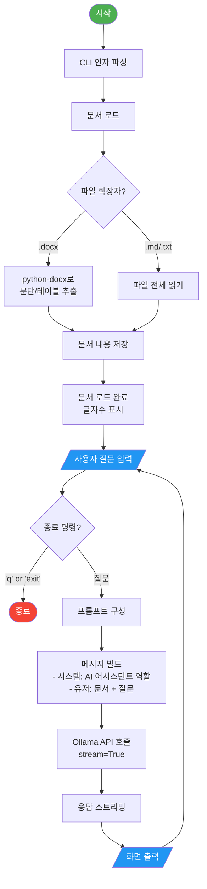
```mermaid
flowchart TD
    START([시작]) --> ARGS[CLI 인자 파싱]
    ARGS --> LOAD[문서 로드]

    LOAD --> CHECK_EXT{파일 확장자?}

    CHECK_EXT -->|.docx| DOCX[python-docx로<br/>문단/테이블 추출]
    CHECK_EXT -->|.md/.txt| TEXT[파일 전체 읽기]

    DOCX --> CONTENT[문서 내용 저장]
    TEXT --> CONTENT

    CONTENT --> DISPLAY[문서 로드 완료<br/>글자수 표시]

    DISPLAY --> INPUT[/사용자 질문 입력/]

    INPUT --> EXIT_CHECK{종료 명령?}

    EXIT_CHECK -->|'q' or 'exit'| END([종료])

    EXIT_CHECK -->|질문| PROMPT[프롬프트 구성]

    PROMPT --> BUILD_MSG["메시지 빌드<br/>- 시스템: AI 어시스턴트 역할<br/>- 유저: 문서 + 질문"]

    BUILD_MSG --> CALL_LLM[Ollama API 호출<br/>stream=True]

    CALL_LLM --> STREAM[응답 스트리밍]

    STREAM --> PRINT[/화면 출력/]

    PRINT --> INPUT

    style START fill:#4caf50,color:#fff
    style END fill:#f44336,color:#fff
    style INPUT fill:#2196f3,color:#fff
    style PRINT fill:#2196f3,color:#fff
```

---

## 4. Advanced RAG Bot 상세

### 4.1 Advanced RAG Bot 시퀀스 다이어그램

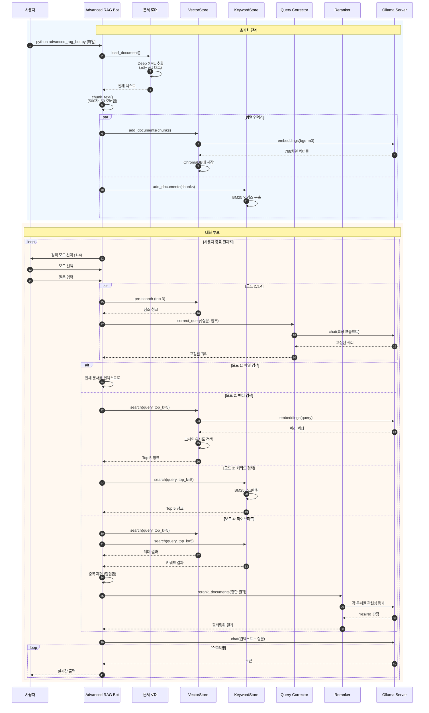
```mermaid
sequenceDiagram
    autonumber
    participant U as 사용자
    participant Bot as Advanced RAG Bot
    participant Loader as 문서 로더
    participant VS as VectorStore
    participant KS as KeywordStore
    participant QC as Query Corrector
    participant RR as Reranker
    participant Ollama as Ollama Server

    %% 초기화 단계
    rect rgb(240, 248, 255)
        Note over Bot,Ollama: 초기화 단계
        U->>Bot: python advanced_rag_bot.py [파일]
        Bot->>Loader: load_document()
        Loader->>Loader: Deep XML 추출<br/>(모든 w:t 태그)
        Loader-->>Bot: 전체 텍스트

        Bot->>Bot: chunk_text()<br/>(500자, 50 오버랩)

        par 병렬 인덱싱
            Bot->>VS: add_documents(chunks)
            VS->>Ollama: embeddings(bge-m3)
            Ollama-->>VS: 768차원 벡터들
            VS->>VS: ChromaDB에 저장
        and
            Bot->>KS: add_documents(chunks)
            KS->>KS: BM25 인덱스 구축
        end
    end

    %% 대화 루프
    rect rgb(255, 248, 240)
        Note over U,Ollama: 대화 루프
        loop 사용자 종료 전까지
            Bot->>U: 검색 모드 선택 (1-4)
            U->>Bot: 모드 선택
            U->>Bot: 질문 입력

            %% 쿼리 교정
            alt 모드 2,3,4
                Bot->>VS: pre-search (top 3)
                VS-->>Bot: 참조 청크
                Bot->>QC: correct_query(질문, 참조)
                QC->>Ollama: chat(교정 프롬프트)
                Ollama-->>QC: 교정된 쿼리
                QC-->>Bot: 교정된 쿼리
            end

            %% 검색 실행
            alt 모드 1: 파일 검색
                Bot->>Bot: 전체 문서를 컨텍스트로
            else 모드 2: 벡터 검색
                Bot->>VS: search(query, top_k=5)
                VS->>Ollama: embeddings(query)
                Ollama-->>VS: 쿼리 벡터
                VS->>VS: 코사인 유사도 검색
                VS-->>Bot: Top 5 청크
            else 모드 3: 키워드 검색
                Bot->>KS: search(query, top_k=5)
                KS->>KS: BM25 스코어링
                KS-->>Bot: Top 5 청크
            else 모드 4: 하이브리드
                Bot->>VS: search(query, top_k=5)
                Bot->>KS: search(query, top_k=5)
                VS-->>Bot: 벡터 결과
                KS-->>Bot: 키워드 결과
                Bot->>Bot: 중복 제거 (합집합)
                Bot->>RR: rerank_documents(결합 결과)
                RR->>Ollama: 각 문서별 관련성 평가
                Ollama-->>RR: Yes/No 판정
                RR-->>Bot: 필터링된 결과
            end

            %% 응답 생성
            Bot->>Ollama: chat(컨텍스트 + 질문)
            loop 스트리밍
                Ollama-->>Bot: 토큰
                Bot-->>U: 실시간 출력
            end
        end
    end
```

### 4.2 Advanced RAG Bot 전체 흐름도

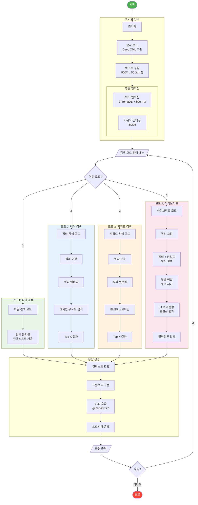
```mermaid
flowchart TD
    START([시작]) --> INIT[초기화]

    subgraph INIT_PHASE["초기화 단계"]
        INIT --> LOAD[문서 로드<br/>Deep XML 추출]
        LOAD --> CHUNK[텍스트 청킹<br/>500자 / 50 오버랩]
        CHUNK --> PAR_INDEX

        subgraph PAR_INDEX["병렬 인덱싱"]
            direction LR
            VEC_IDX[벡터 인덱싱<br/>ChromaDB + bge-m3]
            KEY_IDX[키워드 인덱싱<br/>BM25]
        end
    end

    PAR_INDEX --> MENU[/검색 모드 선택 메뉴/]

    MENU --> MODE{어떤 모드?}

    MODE -->|1| FILE_MODE[파일 검색 모드]
    MODE -->|2| VEC_MODE[벡터 검색 모드]
    MODE -->|3| KEY_MODE[키워드 검색 모드]
    MODE -->|4| HYB_MODE[하이브리드 모드]

    subgraph FILE_SEARCH["모드 1: 파일 검색"]
        FILE_MODE --> FILE_CTX[전체 문서를<br/>컨텍스트로 사용]
    end

    subgraph VEC_SEARCH["모드 2: 벡터 검색"]
        VEC_MODE --> VEC_QC[쿼리 교정]
        VEC_QC --> VEC_EMB[쿼리 임베딩]
        VEC_EMB --> VEC_SIM[코사인 유사도 검색]
        VEC_SIM --> VEC_TOP[Top K 결과]
    end

    subgraph KEY_SEARCH["모드 3: 키워드 검색"]
        KEY_MODE --> KEY_QC[쿼리 교정]
        KEY_QC --> KEY_TOK[쿼리 토큰화]
        KEY_TOK --> KEY_BM25[BM25 스코어링]
        KEY_BM25 --> KEY_TOP[Top K 결과]
    end

    subgraph HYB_SEARCH["모드 4: 하이브리드"]
        HYB_MODE --> HYB_QC[쿼리 교정]
        HYB_QC --> HYB_BOTH[벡터 + 키워드<br/>동시 검색]
        HYB_BOTH --> HYB_MERGE[결과 병합<br/>중복 제거]
        HYB_MERGE --> HYB_RERANK[LLM 리랭킹<br/>관련성 평가]
        HYB_RERANK --> HYB_TOP[필터링된 결과]
    end

    FILE_CTX --> GEN
    VEC_TOP --> GEN
    KEY_TOP --> GEN
    HYB_TOP --> GEN

    subgraph GENERATION["응답 생성"]
        GEN[컨텍스트 조합] --> PROMPT_BUILD[프롬프트 구성]
        PROMPT_BUILD --> LLM_CALL[LLM 호출<br/>gemma3:12b]
        LLM_CALL --> STREAM[스트리밍 응답]
    end

    STREAM --> OUTPUT[/화면 출력/]
    OUTPUT --> CONTINUE{계속?}

    CONTINUE -->|예| MENU
    CONTINUE -->|아니오| END([종료])

    style START fill:#4caf50,color:#fff
    style END fill:#f44336,color:#fff
    style FILE_SEARCH fill:#e8f5e9
    style VEC_SEARCH fill:#e3f2fd
    style KEY_SEARCH fill:#fff3e0
    style HYB_SEARCH fill:#fce4ec
```

---

## 5. 문서 인덱싱 상세

이 섹션에서는 문서가 검색 가능한 형태로 변환되는 **인덱싱 과정**을 상세히 설명합니다.

### 5.1 인덱싱 전체 흐름

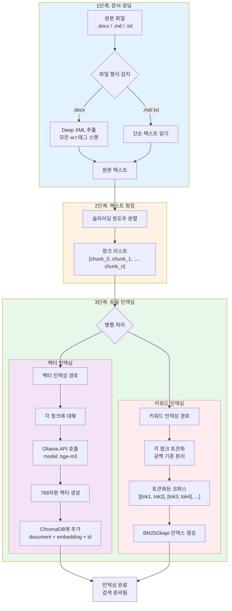
```mermaid
flowchart TD
    subgraph LOAD["1단계: 문서 로딩"]
        FILE[원본 파일<br/>.docx / .md / .txt] --> DETECT{파일 형식 감지}
        DETECT -->|.docx| DEEP_XML[Deep XML 추출<br/>모든 w:t 태그 스캔]
        DETECT -->|.md/.txt| SIMPLE[단순 텍스트 읽기]
        DEEP_XML --> RAW_TEXT[원본 텍스트]
        SIMPLE --> RAW_TEXT
    end

    subgraph CHUNK["2단계: 텍스트 청킹"]
        RAW_TEXT --> SLIDING[슬라이딩 윈도우 분할]
        SLIDING --> CHUNKS["청크 리스트<br/>[chunk_0, chunk_1, ..., chunk_n]"]
    end

    subgraph INDEX["3단계: 듀얼 인덱싱"]
        CHUNKS --> PARALLEL{병렬 처리}

        PARALLEL --> VEC_PATH[벡터 인덱싱 경로]
        PARALLEL --> KEY_PATH[키워드 인덱싱 경로]

        subgraph VECTOR_INDEX["벡터 인덱싱"]
            VEC_PATH --> EMB_LOOP[각 청크에 대해]
            EMB_LOOP --> OLLAMA_EMB[Ollama API 호출<br/>model: bge-m3]
            OLLAMA_EMB --> VEC_768[768차원 벡터 생성]
            VEC_768 --> CHROMA_ADD[ChromaDB에 추가<br/>document + embedding + id]
        end

        subgraph KEYWORD_INDEX["키워드 인덱싱"]
            KEY_PATH --> TOKENIZE[각 청크 토큰화<br/>공백 기준 분리]
            TOKENIZE --> CORPUS["토큰화된 코퍼스<br/>[[tok1, tok2], [tok3, tok4], ...]"]
            CORPUS --> BM25_BUILD[BM25Okapi 인덱스 생성]
        end
    end

    CHROMA_ADD --> READY[인덱싱 완료<br/>검색 준비됨]
    BM25_BUILD --> READY

    style LOAD fill:#e3f2fd
    style CHUNK fill:#fff3e0
    style INDEX fill:#e8f5e9
    style VECTOR_INDEX fill:#f3e5f5
    style KEYWORD_INDEX fill:#ffebee
```

### 5.2 문서 로딩 상세 (Deep XML 추출)

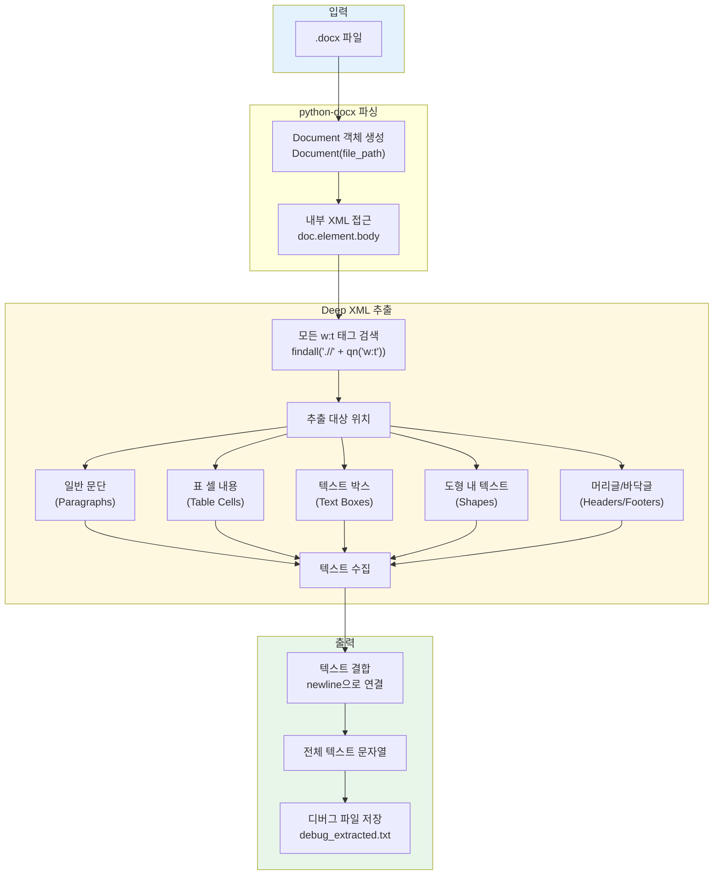
```mermaid
flowchart TD
    subgraph INPUT["입력"]
        DOCX_FILE[".docx 파일"]
    end

    subgraph PARSE["python-docx 파싱"]
        DOCX_FILE --> DOC_OBJ["Document 객체 생성<br/>Document(file_path)"]
        DOC_OBJ --> ACCESS_XML["내부 XML 접근<br/>doc.element.body"]
    end

    subgraph DEEP_EXTRACT["Deep XML 추출"]
        ACCESS_XML --> FIND_ALL["모든 w:t 태그 검색<br/>findall('.//' + qn('w:t'))"]

        FIND_ALL --> LOCATIONS["추출 대상 위치"]

        LOCATIONS --> P["일반 문단<br/>(Paragraphs)"]
        LOCATIONS --> T["표 셀 내용<br/>(Table Cells)"]
        LOCATIONS --> TB["텍스트 박스<br/>(Text Boxes)"]
        LOCATIONS --> SH["도형 내 텍스트<br/>(Shapes)"]
        LOCATIONS --> HD["머리글/바닥글<br/>(Headers/Footers)"]

        P --> COLLECT[텍스트 수집]
        T --> COLLECT
        TB --> COLLECT
        SH --> COLLECT
        HD --> COLLECT
    end

    subgraph OUTPUT["출력"]
        COLLECT --> JOIN["텍스트 결합<br/>newline으로 연결"]
        JOIN --> FULL_TEXT["전체 텍스트 문자열"]
        FULL_TEXT --> DEBUG["디버그 파일 저장<br/>debug_extracted.txt"]
    end

    style INPUT fill:#e3f2fd
    style DEEP_EXTRACT fill:#fff8e1
    style OUTPUT fill:#e8f5e9
```

#### Deep XML 추출 코드 설명

```python
# 기존 방식 (누락 발생 가능)
for para in doc.paragraphs:
    text += para.text  # 텍스트 박스, 도형 내 텍스트 누락!

# Deep XML 방식 (모든 텍스트 추출)
from docx.oxml.ns import qn
for t in doc.element.body.findall('.//' + qn('w:t')):
    if t.text:
        full_text.append(t.text)  # 모든 위치의 텍스트 포착!
```

### 5.3 텍스트 청킹 상세

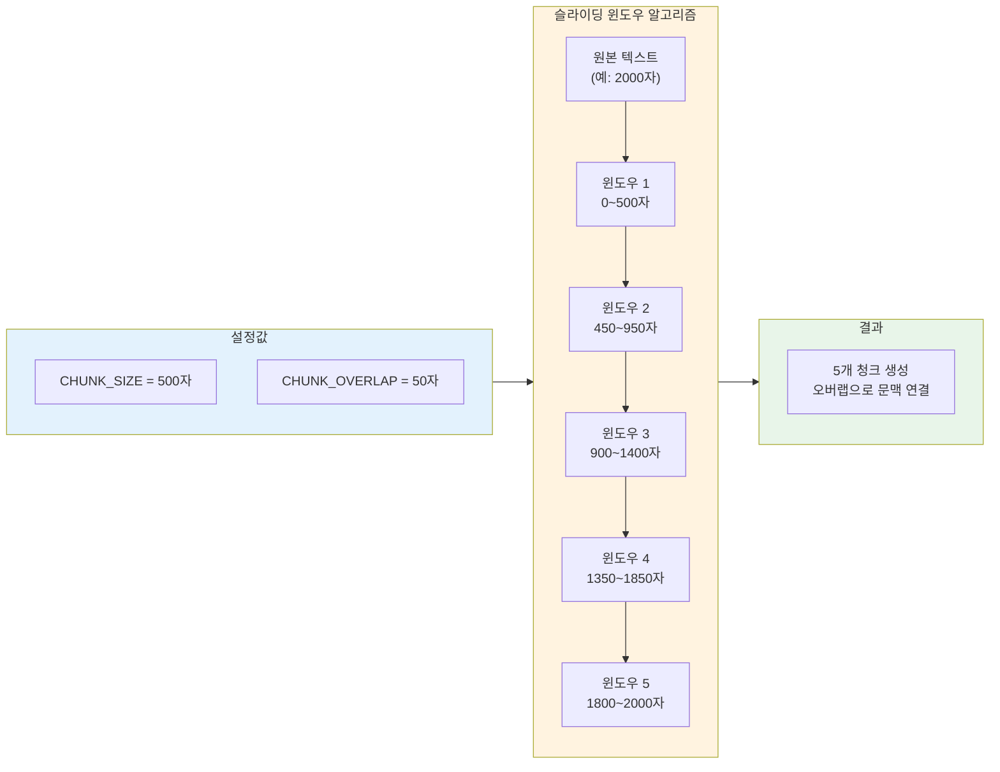
```mermaid
flowchart LR
    subgraph CONFIG["설정값"]
        SIZE["CHUNK_SIZE = 500자"]
        OVERLAP["CHUNK_OVERLAP = 50자"]
    end

    subgraph ALGORITHM["슬라이딩 윈도우 알고리즘"]
        direction TB
        TEXT["원본 텍스트<br/>(예: 2000자)"]

        TEXT --> W1["윈도우 1<br/>0~500자"]
        W1 --> W2["윈도우 2<br/>450~950자"]
        W2 --> W3["윈도우 3<br/>900~1400자"]
        W3 --> W4["윈도우 4<br/>1350~1850자"]
        W4 --> W5["윈도우 5<br/>1800~2000자"]
    end

    subgraph RESULT["결과"]
        CHUNKS["5개 청크 생성<br/>오버랩으로 문맥 연결"]
    end

    CONFIG --> ALGORITHM
    ALGORITHM --> RESULT

    style CONFIG fill:#e3f2fd
    style ALGORITHM fill:#fff3e0
    style RESULT fill:#e8f5e9
```

#### 청킹 시각화 예시

```
원본 텍스트 (2000자):
┌──────────────────────────────────────────────────────────────────────────┐
│ AAAAA...AAAAA │ BBBBB...BBBBB │ CCCCC...CCCCC │ DDDDD...DDDDD │ EEEE...  │
│    (500자)    │    (500자)    │    (500자)    │    (500자)    │          │
└──────────────────────────────────────────────────────────────────────────┘

청킹 결과 (50자 오버랩):
┌─────────────────────┐
│ Chunk 0: AAAAA...   │  (0~500)
│    └──────┐         │
│           ▼         │
│ Chunk 1: ..AAA+BBBB │  (450~950) ← 50자 오버랩
│           └──────┐  │
│                  ▼  │
│ Chunk 2: ..BBB+CCCC │  (900~1400)
│                  ...│
└─────────────────────┘

오버랩의 목적: 청크 경계에서 문맥이 끊기는 것을 방지
```

### 5.4 벡터 인덱싱 상세 (ChromaDB + bge-m3)

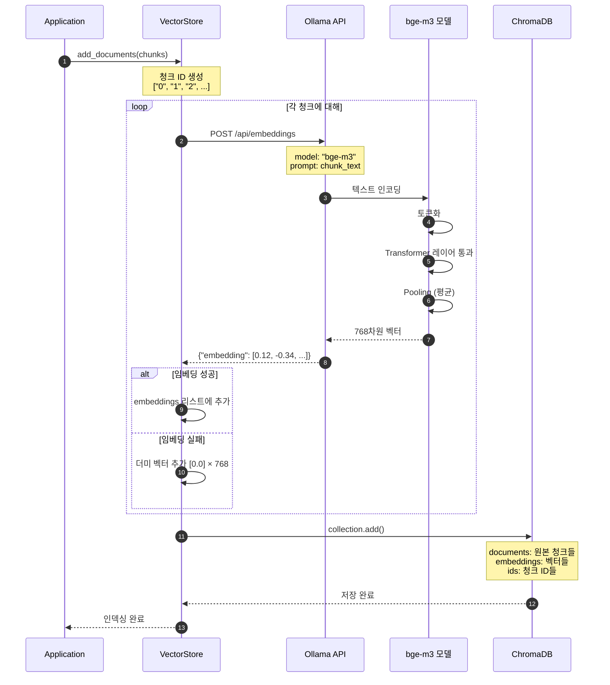
```mermaid
sequenceDiagram
    autonumber
    participant App as Application
    participant VS as VectorStore
    participant Ollama as Ollama API
    participant BGE as bge-m3 모델
    participant Chroma as ChromaDB

    App->>VS: add_documents(chunks)

    Note over VS: 청크 ID 생성<br/>["0", "1", "2", ...]

    loop 각 청크에 대해
        VS->>Ollama: POST /api/embeddings
        Note over Ollama: model: "bge-m3"<br/>prompt: chunk_text

        Ollama->>BGE: 텍스트 인코딩
        BGE->>BGE: 토큰화
        BGE->>BGE: Transformer 레이어 통과
        BGE->>BGE: Pooling (평균)
        BGE-->>Ollama: 768차원 벡터

        Ollama-->>VS: {"embedding": [0.12, -0.34, ...]}

        alt 임베딩 성공
            VS->>VS: embeddings 리스트에 추가
        else 임베딩 실패
            VS->>VS: 더미 벡터 추가 [0.0] × 768
        end
    end

    VS->>Chroma: collection.add()
    Note over Chroma: documents: 원본 청크들<br/>embeddings: 벡터들<br/>ids: 청크 ID들

    Chroma-->>VS: 저장 완료
    VS-->>App: 인덱싱 완료
```

#### 벡터 저장 구조

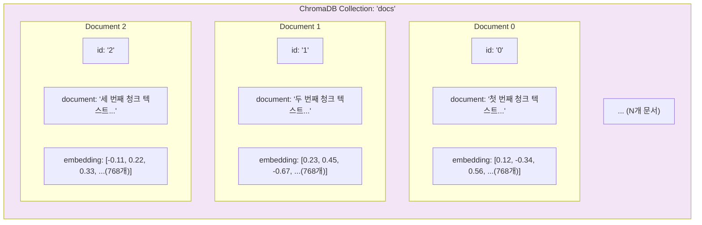
```mermaid
flowchart TB
    subgraph CHROMADB["ChromaDB Collection: 'docs'"]
        direction TB

        subgraph ROW0["Document 0"]
            ID0["id: '0'"]
            DOC0["document: '첫 번째 청크 텍스트...'"]
            EMB0["embedding: [0.12, -0.34, 0.56, ...(768개)]"]
        end

        subgraph ROW1["Document 1"]
            ID1["id: '1'"]
            DOC1["document: '두 번째 청크 텍스트...'"]
            EMB1["embedding: [0.23, 0.45, -0.67, ...(768개)]"]
        end

        subgraph ROW2["Document 2"]
            ID2["id: '2'"]
            DOC2["document: '세 번째 청크 텍스트...'"]
            EMB2["embedding: [-0.11, 0.22, 0.33, ...(768개)]"]
        end

        MORE["... (N개 문서)"]
    end

    style CHROMADB fill:#f3e5f5
```

#### bge-m3 임베딩 모델 특성

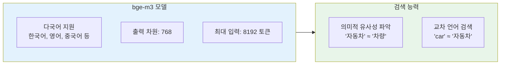
```mermaid
flowchart LR
    subgraph MODEL["bge-m3 모델"]
        direction TB
        MULTI["다국어 지원<br/>한국어, 영어, 중국어 등"]
        DIM["출력 차원: 768"]
        MAX["최대 입력: 8192 토큰"]
    end

    subgraph CAPABILITY["검색 능력"]
        direction TB
        SEM["의미적 유사성 파악<br/>'자동차' ≈ '차량'"]
        CROSS["교차 언어 검색<br/>'car' ≈ '자동차'"]
    end

    MODEL --> CAPABILITY

    style MODEL fill:#e3f2fd
    style CAPABILITY fill:#e8f5e9
```

### 5.5 키워드 인덱싱 상세 (BM25)

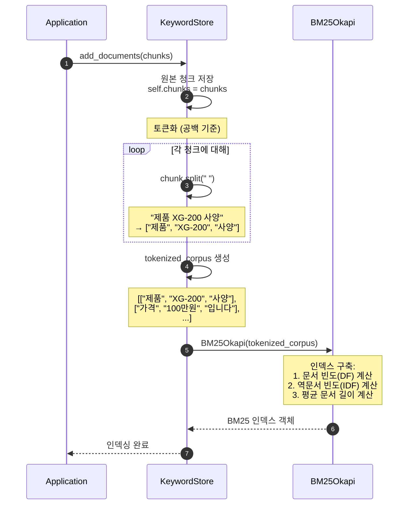
```mermaid
sequenceDiagram
    autonumber
    participant App as Application
    participant KS as KeywordStore
    participant BM25 as BM25Okapi

    App->>KS: add_documents(chunks)

    KS->>KS: 원본 청크 저장<br/>self.chunks = chunks

    Note over KS: 토큰화 (공백 기준)

    loop 각 청크에 대해
        KS->>KS: chunk.split(" ")
        Note over KS: "제품 XG-200 사양"<br/>→ ["제품", "XG-200", "사양"]
    end

    KS->>KS: tokenized_corpus 생성
    Note over KS: [["제품", "XG-200", "사양"],<br/> ["가격", "100만원", "입니다"],<br/> ...]

    KS->>BM25: BM25Okapi(tokenized_corpus)

    Note over BM25: 인덱스 구축:<br/>1. 문서 빈도(DF) 계산<br/>2. 역문서 빈도(IDF) 계산<br/>3. 평균 문서 길이 계산

    BM25-->>KS: BM25 인덱스 객체
    KS-->>App: 인덱싱 완료
```

#### BM25 인덱스 내부 구조

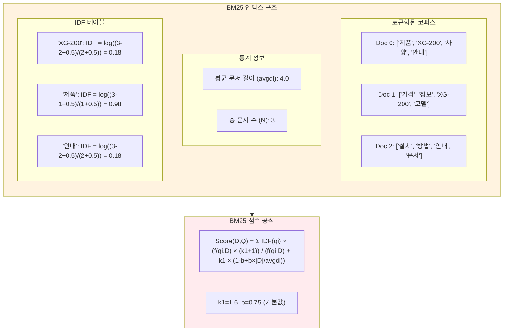
```mermaid
flowchart TD
    subgraph BM25_INDEX["BM25 인덱스 구조"]
        direction TB

        subgraph CORPUS["토큰화된 코퍼스"]
            D0["Doc 0: ['제품', 'XG-200', '사양', '안내']"]
            D1["Doc 1: ['가격', '정보', 'XG-200', '모델']"]
            D2["Doc 2: ['설치', '방법', '안내', '문서']"]
        end

        subgraph STATS["통계 정보"]
            AVGDL["평균 문서 길이 (avgdl): 4.0"]
            N["총 문서 수 (N): 3"]
        end

        subgraph IDF_TABLE["IDF 테이블"]
            IDF1["'XG-200': IDF = log((3-2+0.5)/(2+0.5)) = 0.18"]
            IDF2["'제품': IDF = log((3-1+0.5)/(1+0.5)) = 0.98"]
            IDF3["'안내': IDF = log((3-2+0.5)/(2+0.5)) = 0.18"]
        end
    end

    subgraph FORMULA["BM25 점수 공식"]
        F["Score(D,Q) = Σ IDF(qi) × (f(qi,D) × (k1+1)) / (f(qi,D) + k1 × (1-b+b×|D|/avgdl))"]
        NOTE["k1=1.5, b=0.75 (기본값)"]
    end

    BM25_INDEX --> FORMULA

    style BM25_INDEX fill:#fff3e0
    style FORMULA fill:#ffebee
```

#### BM25 vs 벡터 검색 비교

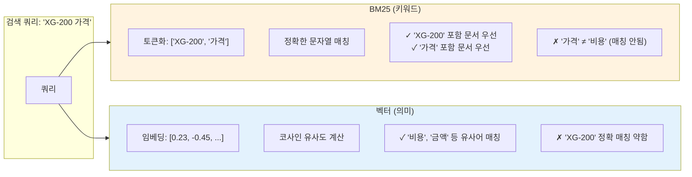
```mermaid
flowchart LR
    subgraph QUERY["검색 쿼리: 'XG-200 가격'"]
        Q["쿼리"]
    end

    subgraph BM25_SEARCH["BM25 (키워드)"]
        direction TB
        BM_TOK["토큰화: ['XG-200', '가격']"]
        BM_MATCH["정확한 문자열 매칭"]
        BM_RESULT["✓ 'XG-200' 포함 문서 우선<br/>✓ '가격' 포함 문서 우선"]
        BM_WEAK["✗ '가격' ≠ '비용' (매칭 안됨)"]
    end

    subgraph VEC_SEARCH["벡터 (의미)"]
        direction TB
        VEC_EMB["임베딩: [0.23, -0.45, ...]"]
        VEC_SIM["코사인 유사도 계산"]
        VEC_RESULT["✓ '비용', '금액' 등 유사어 매칭"]
        VEC_WEAK["✗ 'XG-200' 정확 매칭 약함"]
    end

    Q --> BM25_SEARCH
    Q --> VEC_SEARCH

    style BM25_SEARCH fill:#fff3e0
    style VEC_SEARCH fill:#e3f2fd
```

### 5.6 인덱싱 성능 및 리소스

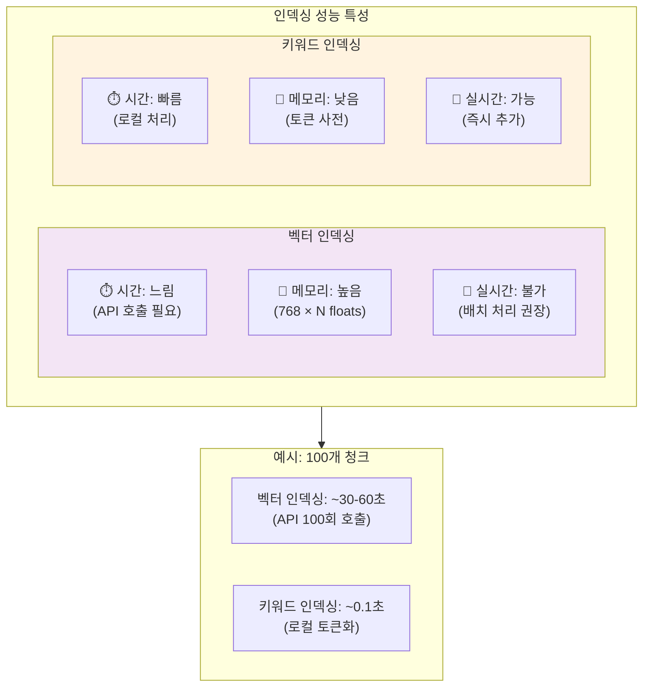
```mermaid
flowchart TB
    subgraph PERF["인덱싱 성능 특성"]
        direction LR

        subgraph VECTOR_PERF["벡터 인덱싱"]
            VP1["⏱️ 시간: 느림<br/>(API 호출 필요)"]
            VP2["💾 메모리: 높음<br/>(768 × N floats)"]
            VP3["🔄 실시간: 불가<br/>(배치 처리 권장)"]
        end

        subgraph KEYWORD_PERF["키워드 인덱싱"]
            KP1["⏱️ 시간: 빠름<br/>(로컬 처리)"]
            KP2["💾 메모리: 낮음<br/>(토큰 사전)"]
            KP3["🔄 실시간: 가능<br/>(즉시 추가)"]
        end
    end

    subgraph EXAMPLE["예시: 100개 청크"]
        E1["벡터 인덱싱: ~30-60초<br/>(API 100회 호출)"]
        E2["키워드 인덱싱: ~0.1초<br/>(로컬 토큰화)"]
    end

    PERF --> EXAMPLE

    style VECTOR_PERF fill:#f3e5f5
    style KEYWORD_PERF fill:#fff3e0
```

### 5.7 인덱싱 완료 후 데이터 구조

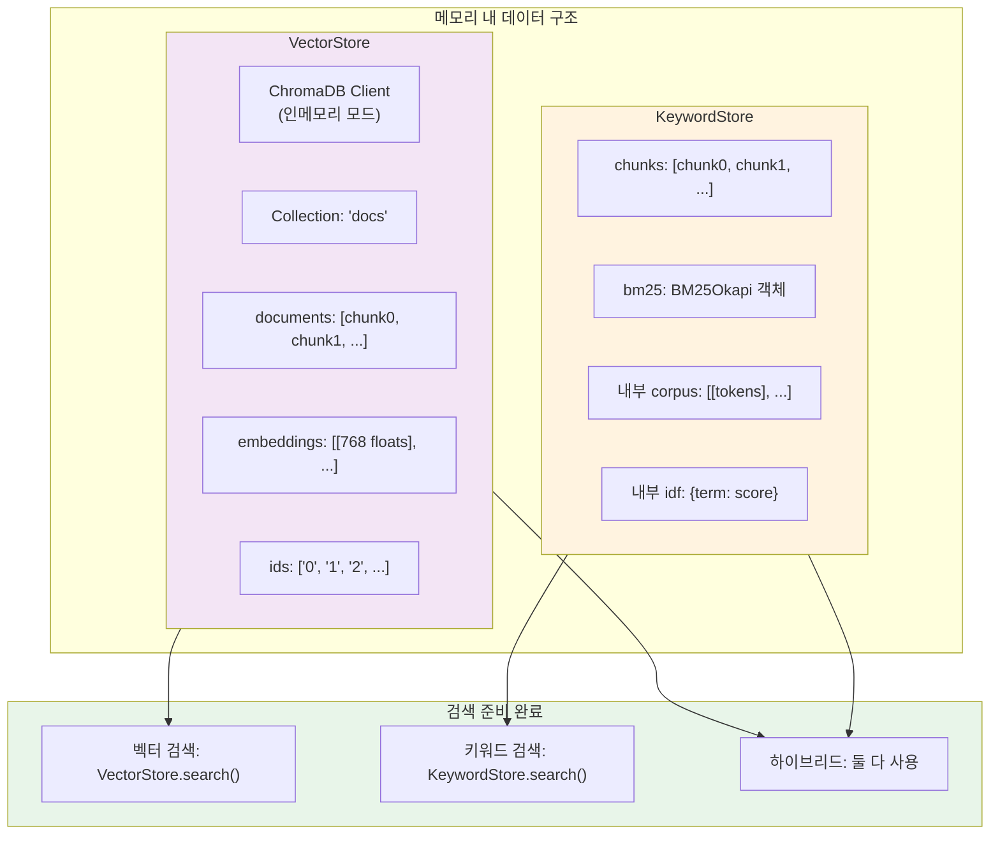
```mermaid
flowchart TB
    subgraph MEMORY["메모리 내 데이터 구조"]
        direction TB

        subgraph VS_DATA["VectorStore"]
            VS_CLIENT["ChromaDB Client<br/>(인메모리 모드)"]
            VS_COLL["Collection: 'docs'"]
            VS_DOCS["documents: [chunk0, chunk1, ...]"]
            VS_EMBS["embeddings: [[768 floats], ...]"]
            VS_IDS["ids: ['0', '1', '2', ...]"]
        end

        subgraph KS_DATA["KeywordStore"]
            KS_CHUNKS["chunks: [chunk0, chunk1, ...]"]
            KS_BM25["bm25: BM25Okapi 객체"]
            KS_CORPUS["내부 corpus: [[tokens], ...]"]
            KS_IDF["내부 idf: {term: score}"]
        end
    end

    subgraph READY["검색 준비 완료"]
        R1["벡터 검색: VectorStore.search()"]
        R2["키워드 검색: KeywordStore.search()"]
        R3["하이브리드: 둘 다 사용"]
    end

    VS_DATA --> R1
    KS_DATA --> R2
    VS_DATA --> R3
    KS_DATA --> R3

    style VS_DATA fill:#f3e5f5
    style KS_DATA fill:#fff3e0
    style READY fill:#e8f5e9
```

---

## 6. 검색 모드별 흐름도

### 6.1 벡터 검색 (Semantic Search) 상세

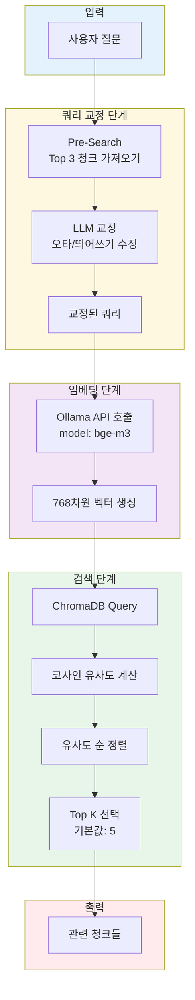
```mermaid
flowchart TD
    subgraph INPUT["입력"]
        Q[사용자 질문]
    end

    subgraph CORRECTION["쿼리 교정 단계"]
        Q --> PRE[Pre-Search<br/>Top 3 청크 가져오기]
        PRE --> LLM_CORRECT[LLM 교정<br/>오타/띄어쓰기 수정]
        LLM_CORRECT --> CQ[교정된 쿼리]
    end

    subgraph EMBEDDING["임베딩 단계"]
        CQ --> EMB_REQ[Ollama API 호출<br/>model: bge-m3]
        EMB_REQ --> EMB_VEC[768차원 벡터 생성]
    end

    subgraph SEARCH["검색 단계"]
        EMB_VEC --> CHROMA[ChromaDB Query]
        CHROMA --> COSINE[코사인 유사도 계산]
        COSINE --> RANK[유사도 순 정렬]
        RANK --> TOPK[Top K 선택<br/>기본값: 5]
    end

    subgraph OUTPUT["출력"]
        TOPK --> CHUNKS[관련 청크들]
    end

    style INPUT fill:#e3f2fd
    style CORRECTION fill:#fff8e1
    style EMBEDDING fill:#f3e5f5
    style SEARCH fill:#e8f5e9
    style OUTPUT fill:#ffebee
```

### 6.2 키워드 검색 (BM25) 상세

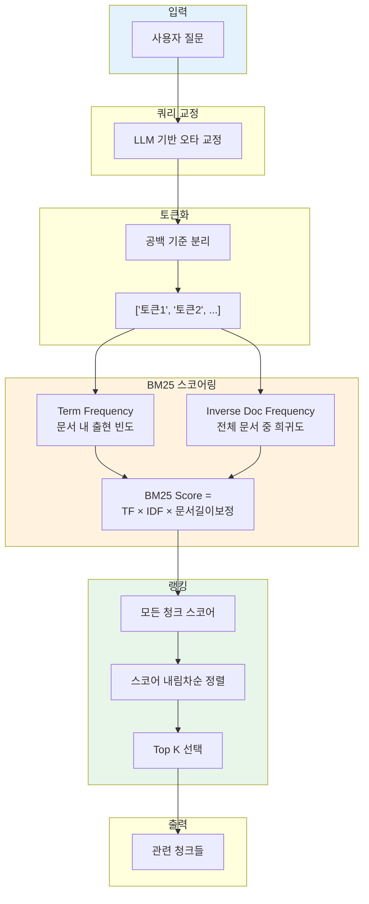
```mermaid
flowchart TD
    subgraph INPUT["입력"]
        Q[사용자 질문]
    end

    subgraph CORRECTION["쿼리 교정"]
        Q --> CQ[LLM 기반 오타 교정]
    end

    subgraph TOKENIZE["토큰화"]
        CQ --> TOK[공백 기준 분리]
        TOK --> TOKENS["['토큰1', '토큰2', ...]"]
    end

    subgraph BM25_CALC["BM25 스코어링"]
        TOKENS --> TF[Term Frequency<br/>문서 내 출현 빈도]
        TOKENS --> IDF[Inverse Doc Frequency<br/>전체 문서 중 희귀도]
        TF --> SCORE[BM25 Score =<br/>TF × IDF × 문서길이보정]
        IDF --> SCORE
    end

    subgraph RANK["랭킹"]
        SCORE --> ALL_SCORES[모든 청크 스코어]
        ALL_SCORES --> SORT[스코어 내림차순 정렬]
        SORT --> TOPK[Top K 선택]
    end

    subgraph OUTPUT["출력"]
        TOPK --> CHUNKS[관련 청크들]
    end

    style INPUT fill:#e3f2fd
    style BM25_CALC fill:#fff3e0
    style RANK fill:#e8f5e9
```

### 6.3 하이브리드 검색 + 리랭킹 상세

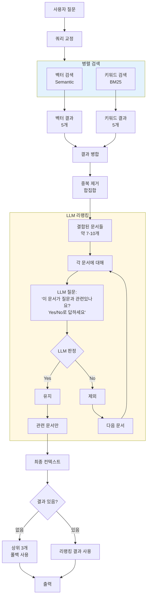
```mermaid
flowchart TD
    Q[사용자 질문] --> QC[쿼리 교정]

    QC --> PARALLEL

    subgraph PARALLEL["병렬 검색"]
        direction LR
        VEC[벡터 검색<br/>Semantic]
        KEY[키워드 검색<br/>BM25]
    end

    VEC --> VR[벡터 결과<br/>5개]
    KEY --> KR[키워드 결과<br/>5개]

    VR --> MERGE[결과 병합]
    KR --> MERGE

    MERGE --> DEDUP[중복 제거<br/>합집합]

    DEDUP --> COMBINED[결합된 문서들<br/>약 7-10개]

    subgraph RERANK["LLM 리랭킹"]
        COMBINED --> LOOP[각 문서에 대해]
        LOOP --> LLM_Q["LLM 질문:<br/>'이 문서가 질문과 관련있나요?<br/>Yes/No로 답하세요'"]
        LLM_Q --> EVAL{LLM 판정}
        EVAL -->|Yes| KEEP[유지]
        EVAL -->|No| DISCARD[제외]
        KEEP --> RESULT
        DISCARD --> NEXT[다음 문서]
        NEXT --> LOOP
    end

    RESULT[관련 문서만] --> FINAL[최종 컨텍스트]

    FINAL --> CHECK{결과 있음?}
    CHECK -->|없음| FALLBACK[상위 3개<br/>폴백 사용]
    CHECK -->|있음| USE[리랭킹 결과 사용]

    FALLBACK --> OUTPUT[출력]
    USE --> OUTPUT

    style PARALLEL fill:#e3f2fd
    style RERANK fill:#fff8e1
```

### 6.4 검색 모드 비교

```mermaid
flowchart LR
    subgraph MODE1["모드 1: 파일 검색"]
        direction TB
        M1_DOC[전체 문서] --> M1_CTX[컨텍스트]
        M1_PROS["장점: 가장 정확"]
        M1_CONS["단점: 토큰 한계"]
    end

    subgraph MODE2["모드 2: 벡터 검색"]
        direction TB
        M2_EMB[임베딩] --> M2_SIM[유사도]
        M2_PROS["장점: 의미 파악"]
        M2_CONS["단점: 정확한 키워드 미스"]
    end

    subgraph MODE3["모드 3: 키워드 검색"]
        direction TB
        M3_TOK[토큰화] --> M3_BM25[BM25]
        M3_PROS["장점: 정확한 매칭"]
        M3_CONS["단점: 동의어 미스"]
    end

    subgraph MODE4["모드 4: 하이브리드"]
        direction TB
        M4_BOTH[벡터+키워드] --> M4_RERANK[리랭킹]
        M4_PROS["장점: 최고 품질"]
        M4_CONS["단점: 느림 (LLM 호출)"]
    end

    style MODE1 fill:#c8e6c9
    style MODE2 fill:#bbdefb
    style MODE3 fill:#ffe0b2
    style MODE4 fill:#f8bbd9
```

---

## 7. 클래스 다이어그램

### 7.1 Advanced RAG Bot 클래스 구조

```mermaid
classDiagram
    class Config {
        +str DOC_PATH
        +str OLLAMA_HOST
        +str MODEL_CHAT
        +str MODEL_EMBED
        +str MODEL_RERANK
        +int CHUNK_SIZE
        +int CHUNK_OVERLAP
        +int TOP_K
        +int NUM_CTX
    }

    class VectorStore {
        -Client client
        -Collection collection
        +__init__()
        +add_documents(chunks: List~str~)
        +search(query: str, top_k: int) List~str~
    }

    class KeywordStore {
        -BM25Okapi bm25
        -List~str~ chunks
        +__init__()
        +add_documents(chunks: List~str~)
        +search(query: str, top_k: int) List~str~
    }

    class DocumentLoader {
        <<module functions>>
        +load_document(file_path: str) str
        +chunk_text(text: str, size: int, overlap: int) List~str~
    }

    class QueryProcessor {
        <<module functions>>
        +correct_query(query: str, context: List~str~) str
    }

    class Reranker {
        <<module functions>>
        +rerank_documents(query: str, docs: List~str~) List~str~
    }

    class OllamaClient {
        <<external>>
        +embeddings(model: str, prompt: str) List~float~
        +chat(model: str, messages: List, stream: bool) Generator
    }

    VectorStore --> OllamaClient : 임베딩 요청
    VectorStore --> Config : 설정 참조
    KeywordStore --> Config : 설정 참조
    QueryProcessor --> OllamaClient : 교정 요청
    Reranker --> OllamaClient : 평가 요청

    DocumentLoader ..> VectorStore : 청크 제공
    DocumentLoader ..> KeywordStore : 청크 제공
```

### 7.2 컴포넌트 관계도

```mermaid
flowchart TB
    subgraph CLI["CLI Layer"]
        MAIN[main 함수]
        ARGS[argparse]
    end

    subgraph CORE["Core Components"]
        DOC[Document Loader]
        CHUNKER[Text Chunker]
        VS[VectorStore]
        KS[KeywordStore]
    end

    subgraph ENHANCEMENT["Enhancement Layer"]
        QC[Query Corrector]
        RR[Document Reranker]
    end

    subgraph GENERATION["Generation Layer"]
        PROMPT[Prompt Builder]
        STREAM[Response Streamer]
    end

    subgraph EXTERNAL["External Services"]
        OLLAMA_EMB[Ollama Embeddings<br/>bge-m3]
        OLLAMA_CHAT[Ollama Chat<br/>gemma3:12b]
        CHROMADB[(ChromaDB<br/>In-Memory)]
        BM25_LIB[rank_bm25<br/>Library]
    end

    MAIN --> ARGS
    MAIN --> DOC
    DOC --> CHUNKER
    CHUNKER --> VS
    CHUNKER --> KS

    VS --> CHROMADB
    VS --> OLLAMA_EMB
    KS --> BM25_LIB

    QC --> OLLAMA_CHAT
    RR --> OLLAMA_CHAT

    PROMPT --> STREAM
    STREAM --> OLLAMA_CHAT

    style CLI fill:#e1f5fe
    style CORE fill:#e8f5e9
    style ENHANCEMENT fill:#fff3e0
    style GENERATION fill:#f3e5f5
    style EXTERNAL fill:#ffebee
```

---

## 8. 데이터 흐름

### 8.1 문서 처리 파이프라인

```mermaid
flowchart LR
    subgraph INPUT["입력 문서"]
        DOCX[.docx 파일]
        MD[.md 파일]
        TXT[.txt 파일]
    end

    subgraph EXTRACTION["텍스트 추출"]
        DOCX --> XML[Deep XML 파싱<br/>모든 w:t 태그]
        MD --> READ[파일 읽기]
        TXT --> READ
        XML --> RAW[원본 텍스트]
        READ --> RAW
    end

    subgraph CHUNKING["청킹"]
        RAW --> SPLIT[슬라이딩 윈도우<br/>500자 / 50 오버랩]
        SPLIT --> CHUNKS["청크 리스트<br/>[chunk1, chunk2, ...]"]
    end

    subgraph INDEXING["인덱싱"]
        CHUNKS --> VEC_IDX[벡터 인덱스<br/>ChromaDB]
        CHUNKS --> KEY_IDX[키워드 인덱스<br/>BM25]
    end

    style INPUT fill:#e3f2fd
    style EXTRACTION fill:#e8f5e9
    style CHUNKING fill:#fff3e0
    style INDEXING fill:#f3e5f5
```

### 8.2 쿼리 처리 파이프라인

```mermaid
flowchart TD
    Q[/"사용자 질문"/] --> MODE{검색 모드}

    MODE -->|모드 2,3,4| CORRECT[쿼리 교정]
    MODE -->|모드 1| SKIP[교정 건너뛰기]

    CORRECT --> PRE_SEARCH[사전 검색<br/>Top 3 청크]
    PRE_SEARCH --> LLM_CORRECT[LLM 교정 호출]
    LLM_CORRECT --> CORRECTED[교정된 쿼리]

    CORRECTED --> RETRIEVE
    SKIP --> RETRIEVE

    subgraph RETRIEVE["검색 단계"]
        direction LR
        R1[벡터 검색]
        R2[키워드 검색]
        R3[하이브리드]
        R4[전체 문서]
    end

    RETRIEVE --> CONTEXT[컨텍스트 청크]

    CONTEXT --> OPTIONAL{모드 4?}
    OPTIONAL -->|예| RERANK[LLM 리랭킹]
    OPTIONAL -->|아니오| BUILD

    RERANK --> BUILD[프롬프트 구성]

    BUILD --> SYSTEM["시스템 메시지<br/>'문서 기반으로 답변...'"]
    BUILD --> USER_MSG["유저 메시지<br/>컨텍스트 + 질문"]

    SYSTEM --> CALL[Ollama Chat 호출]
    USER_MSG --> CALL

    CALL --> STREAM[스트리밍 응답]
    STREAM --> OUTPUT[/"화면 출력"/]

    style Q fill:#2196f3,color:#fff
    style OUTPUT fill:#4caf50,color:#fff
```

### 8.3 임베딩 생성 흐름

```mermaid
flowchart LR
    TEXT[텍스트 청크] --> API[Ollama API<br/>POST /api/embeddings]

    API --> MODEL[bge-m3 모델<br/>다국어 지원]

    MODEL --> ENCODE[텍스트 인코딩<br/>토큰화]

    ENCODE --> TRANSFORM[Transformer<br/>레이어 통과]

    TRANSFORM --> POOL[Pooling<br/>평균/CLS]

    POOL --> VECTOR[768차원 벡터<br/>[0.12, -0.45, ...]]

    VECTOR --> STORE[ChromaDB 저장]

    style TEXT fill:#e3f2fd
    style VECTOR fill:#e8f5e9
    style STORE fill:#f3e5f5
```

---

## 9. 외부 의존성

### 9.1 의존성 구조도

```mermaid
flowchart TB
    subgraph PROJECT["No-RAG Project"]
        NRB[no_rag_bot.py]
        ARB[advanced_rag_bot.py]
    end

    subgraph PYTHON_DEPS["Python 패키지"]
        OLLAMA_PKG[ollama<br/>API 클라이언트]
        DOCX_PKG[python-docx<br/>Word 파서]
        CHROMA_PKG[chromadb<br/>벡터 DB]
        BM25_PKG[rank_bm25<br/>키워드 검색]
    end

    subgraph RUNTIME["런타임 서비스"]
        OLLAMA_SVC[Ollama Server<br/>localhost:11434]

        subgraph MODELS["다운로드된 모델"]
            BGE[bge-m3<br/>임베딩 모델<br/>768차원]
            GEMMA[gemma3:12b<br/>LLM 모델<br/>32K 컨텍스트]
        end
    end

    NRB --> OLLAMA_PKG
    NRB --> DOCX_PKG

    ARB --> OLLAMA_PKG
    ARB --> DOCX_PKG
    ARB --> CHROMA_PKG
    ARB --> BM25_PKG

    OLLAMA_PKG --> OLLAMA_SVC
    OLLAMA_SVC --> BGE
    OLLAMA_SVC --> GEMMA

    style PROJECT fill:#e3f2fd
    style PYTHON_DEPS fill:#e8f5e9
    style RUNTIME fill:#fff3e0
    style MODELS fill:#ffebee
```

### 9.2 API 호출 시퀀스

```mermaid
sequenceDiagram
    participant App as Application
    participant API as Ollama API
    participant EMB as bge-m3
    participant CHAT as gemma3:12b

    Note over App,CHAT: 임베딩 생성
    App->>API: POST /api/embeddings<br/>{"model": "bge-m3", "prompt": "..."}
    API->>EMB: 텍스트 인코딩
    EMB-->>API: 벡터 반환
    API-->>App: {"embedding": [0.12, -0.45, ...]}

    Note over App,CHAT: 채팅 (스트리밍)
    App->>API: POST /api/chat<br/>{"model": "gemma3:12b", "stream": true}
    API->>CHAT: 추론 시작

    loop 토큰 생성
        CHAT-->>API: 토큰
        API-->>App: {"message": {"content": "..."}}
    end

    CHAT-->>API: 완료
    API-->>App: {"done": true}
```

---

## 요약

이 프로젝트는 **문서 기반 Q&A 시스템**의 두 가지 접근 방식을 보여줍니다:

1. **No-RAG Bot**: 단순하지만 효과적인 전체 문서 컨텍스트 방식
2. **Advanced RAG Bot**: 프로덕션 수준의 하이브리드 검색 시스템

주요 기술 스택:
- **LLM**: Ollama (gemma3:12b, bge-m3)
- **벡터 DB**: ChromaDB (인메모리)
- **키워드 검색**: BM25
- **문서 파싱**: python-docx

이 아키텍처의 강점:
- 의미 검색과 키워드 검색의 장점을 결합
- LLM 기반 쿼리 교정으로 검색 품질 향상
- LLM 리랭킹으로 관련성 높은 결과 필터링
- 스트리밍 응답으로 실시간 사용자 경험 제공
