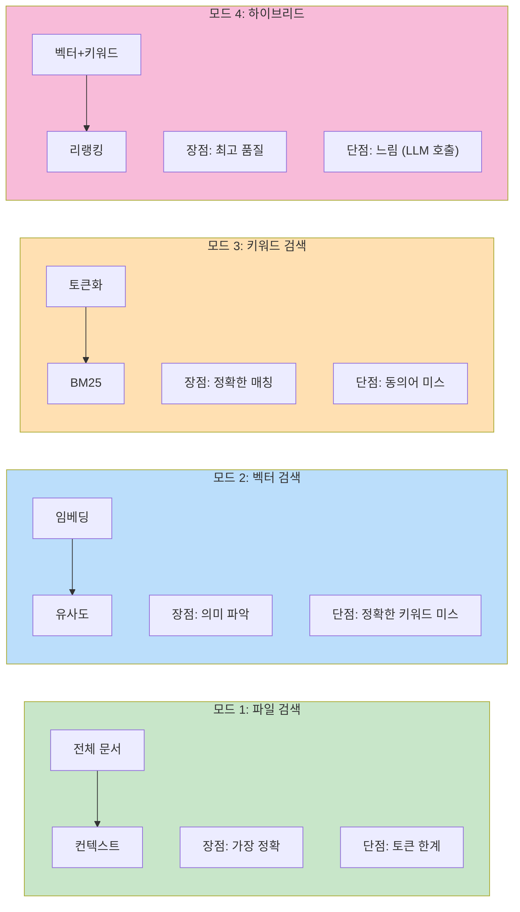
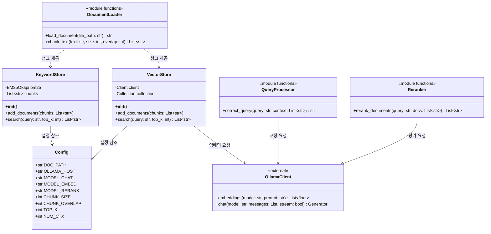
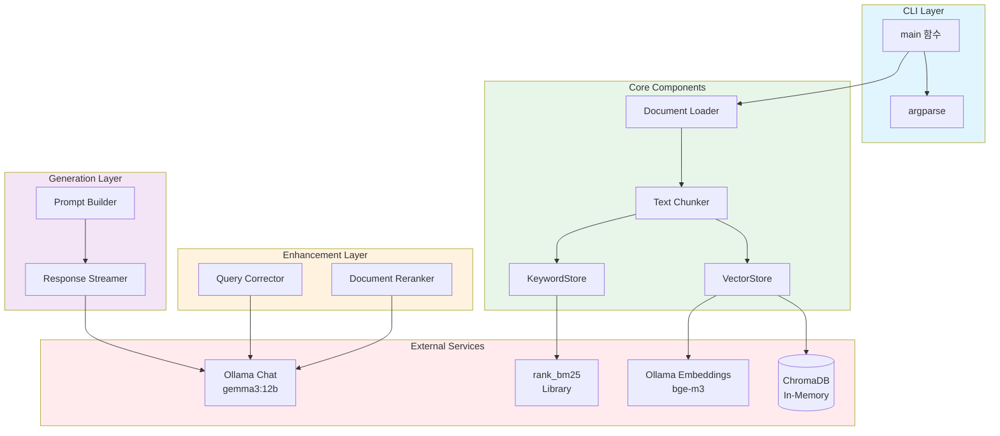
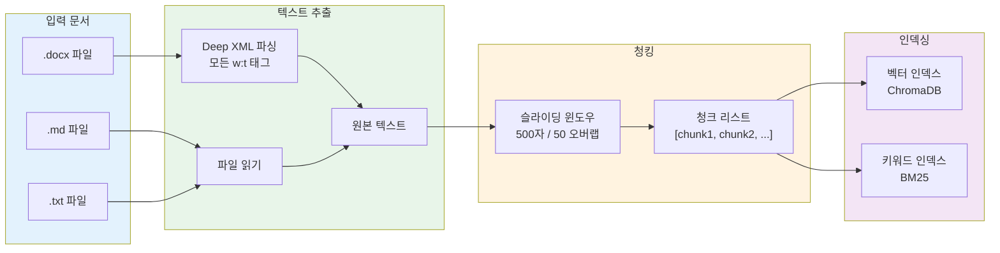
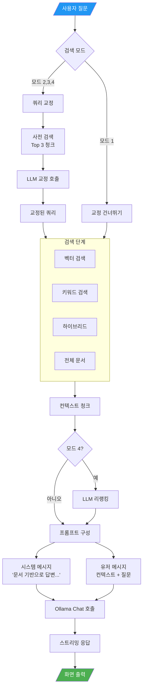
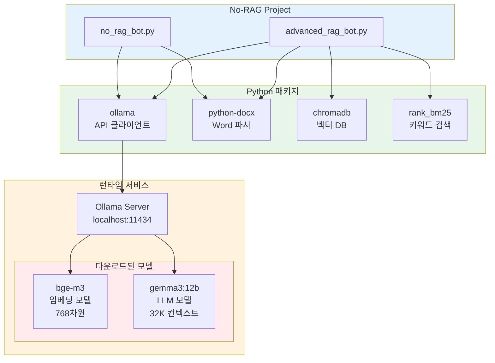
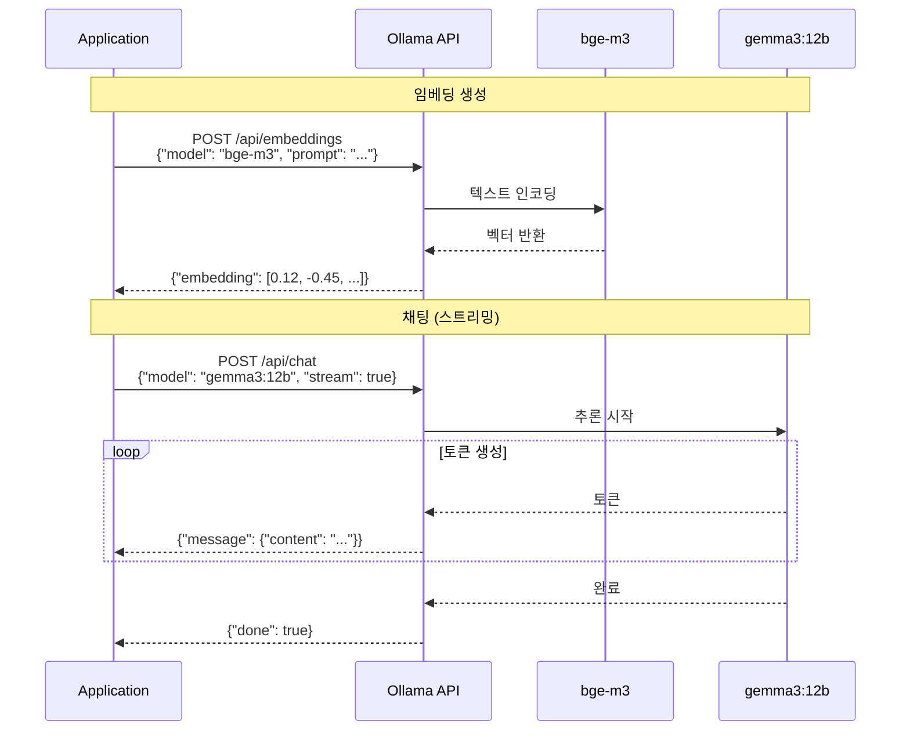

# No-RAG & Advanced RAG Bot 아키텍처 문서

이 문서는 프로젝트의 전체 구조, 컴포넌트 관계, 데이터 흐름을 시각적으로 설명합니다.

---

## 목차

1. [프로젝트 개요](#1-프로젝트-개요)
2. [전체 시스템 아키텍처](#2-전체-시스템-아키텍처)
3. [No-RAG Bot 상세](#3-no-rag-bot-상세)
4. [Advanced RAG Bot 상세](#4-advanced-rag-bot-상세)
5. [검색 모드별 흐름도](#5-검색-모드별-흐름도)
6. [클래스 다이어그램](#6-클래스-다이어그램)
7. [데이터 흐름](#7-데이터-흐름)
8. [외부 의존성](#8-외부-의존성)

---

## 1. 프로젝트 개요

이 프로젝트는 문서 기반 Q&A를 위한 두 가지 접근 방식을 제공합니다:

| 봇 | 설명 | 적합한 문서 크기 |
|---|---|---|
| **No-RAG Bot** | 전체 문서를 컨텍스트로 사용 | 소규모 (~100페이지) |
| **Advanced RAG Bot** | 하이브리드 검색 + 리랭킹 | 대규모 (100~500페이지) |

---

## 2. 전체 시스템 아키텍처

### 2.1 고수준 시스템 구조


### 2.2 두 봇의 아키텍처 비교


---

## 3. No-RAG Bot 상세

### 3.1 No-RAG Bot 시퀀스 다이어그램


### 3.2 No-RAG Bot 내부 흐름도


---

## 4. Advanced RAG Bot 상세

### 4.1 Advanced RAG Bot 시퀀스 다이어그램


### 4.2 Advanced RAG Bot 전체 흐름도


---

## 5. 검색 모드별 흐름도

### 5.1 벡터 검색 (Semantic Search) 상세


### 5.2 키워드 검색 (BM25) 상세


### 5.3 하이브리드 검색 + 리랭킹 상세


### 5.4 검색 모드 비교



---

## 6. 클래스 다이어그램

### 6.1 Advanced RAG Bot 클래스 구조



### 6.2 컴포넌트 관계도



---

## 7. 데이터 흐름

### 7.1 문서 처리 파이프라인



### 7.2 쿼리 처리 파이프라인



### 7.3 임베딩 생성 흐름

```mermaid
flowchart LR
    TEXT[텍스트 청크] --> API[Ollama API<br/>POST /api/embeddings]

    API --> MODEL[bge-m3 모델<br/>다국어 지원]

    MODEL --> ENCODE[텍스트 인코딩<br/>토큰화]

    ENCODE --> TRANSFORM[Transformer<br/>레이어 통과]

    TRANSFORM --> POOL[Pooling<br/>평균/CLS]

    POOL --> VECTOR[768차원 벡터<br/>[0.12, -0.45, ...]]

    VECTOR --> STORE[ChromaDB 저장]

    style TEXT fill:#e3f2fd
    style VECTOR fill:#e8f5e9
    style STORE fill:#f3e5f5
```

---

## 8. 외부 의존성

### 8.1 의존성 구조도



### 8.2 API 호출 시퀀스



---

## 요약

이 프로젝트는 **문서 기반 Q&A 시스템**의 두 가지 접근 방식을 보여줍니다:

1. **No-RAG Bot**: 단순하지만 효과적인 전체 문서 컨텍스트 방식
2. **Advanced RAG Bot**: 프로덕션 수준의 하이브리드 검색 시스템

주요 기술 스택:
- **LLM**: Ollama (gemma3:12b, bge-m3)
- **벡터 DB**: ChromaDB (인메모리)
- **키워드 검색**: BM25
- **문서 파싱**: python-docx

이 아키텍처의 강점:
- 의미 검색과 키워드 검색의 장점을 결합
- LLM 기반 쿼리 교정으로 검색 품질 향상
- LLM 리랭킹으로 관련성 높은 결과 필터링
- 스트리밍 응답으로 실시간 사용자 경험 제공
