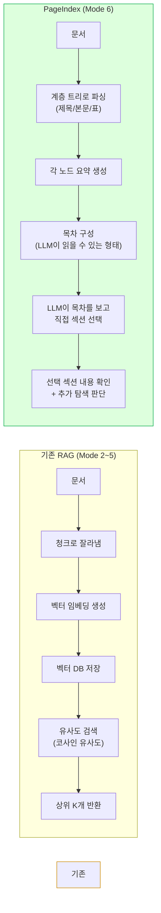
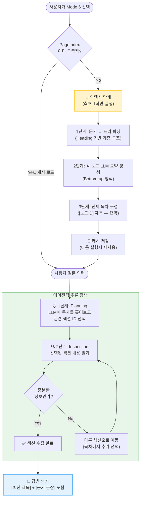
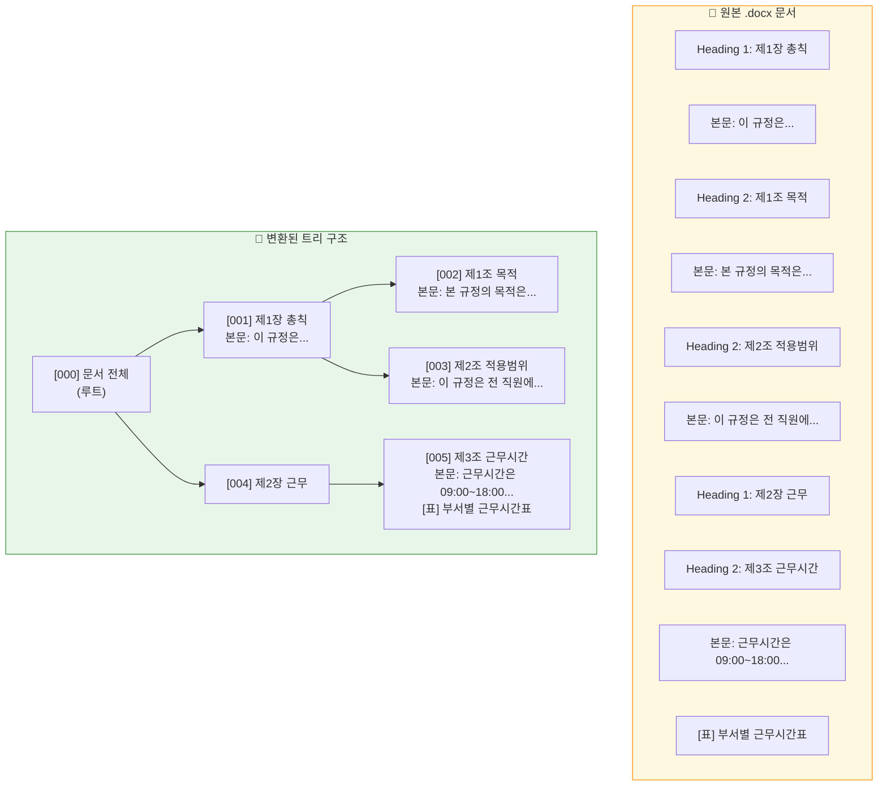
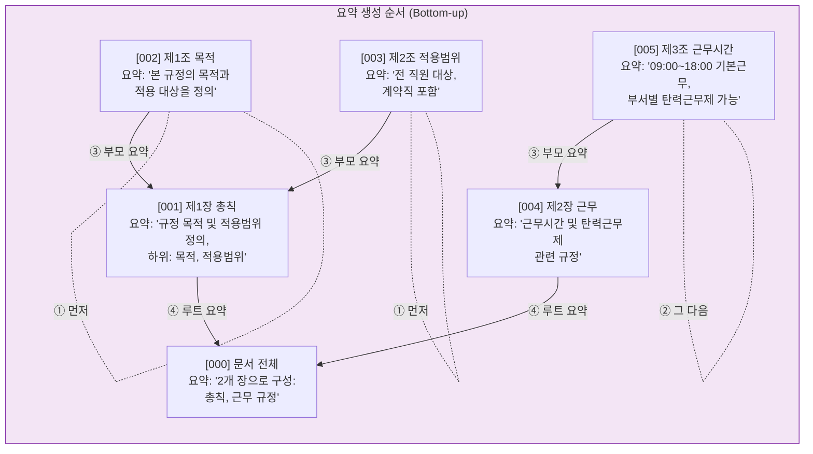
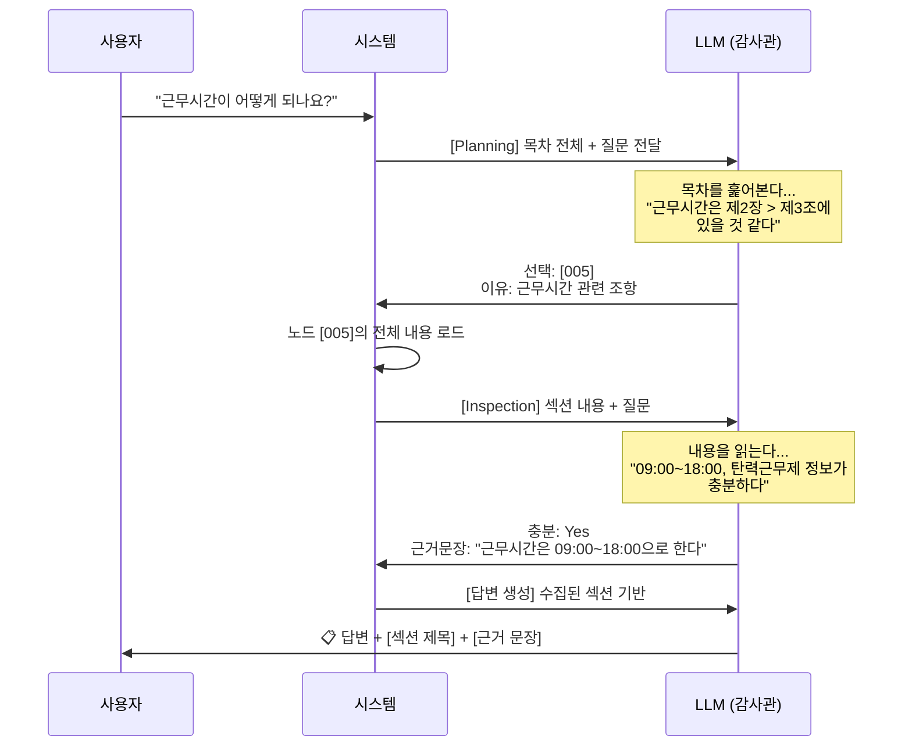
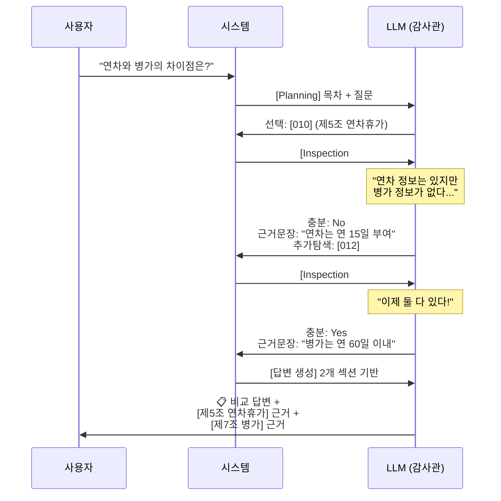
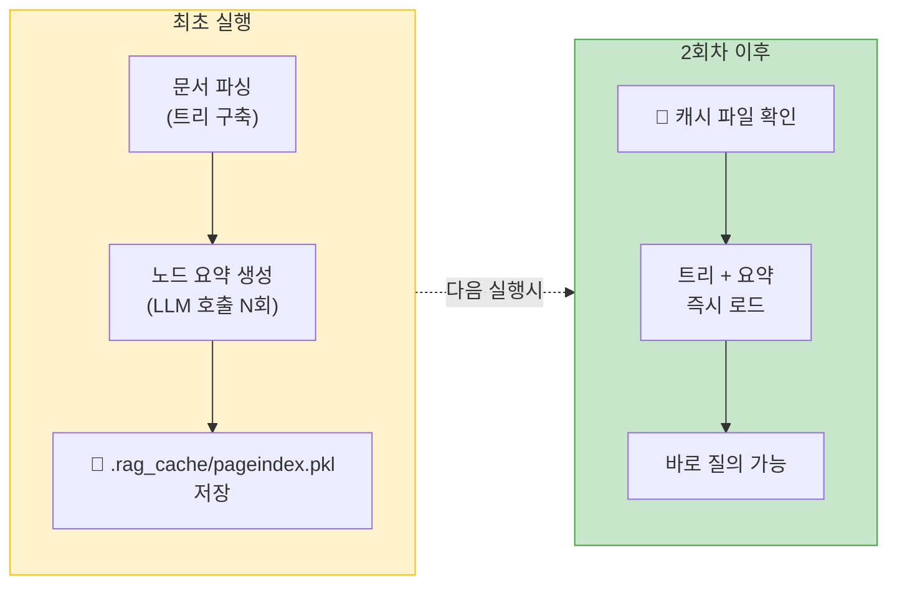
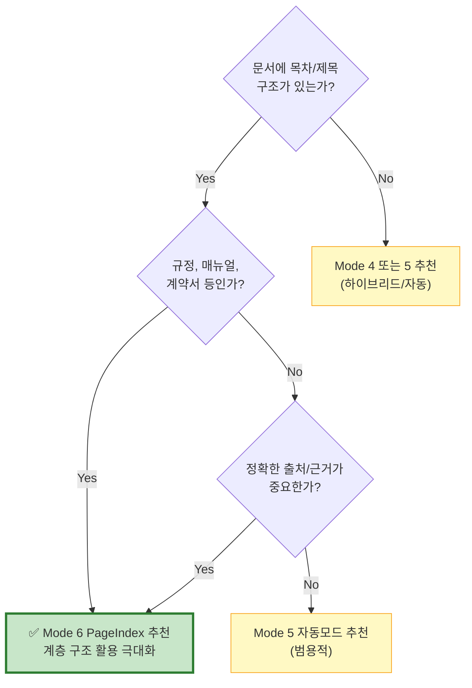

# PageIndex 모드 가이드

## 한 줄 요약

> **벡터 DB 없이**, 문서의 **목차(계층 구조)**를 활용하여 LLM이 **스스로 필요한 섹션을 찾아가는** 검색 방식입니다.

---

## 기존 RAG vs PageIndex 비교



### 핵심 차이점

| 구분 | 기존 RAG | PageIndex |
|------|----------|-----------|
| **검색 기준** | 벡터 유사도 (수학적 거리) | 문서의 논리적 위치 (목차 구조) |
| **필요 인프라** | 벡터 DB (ChromaDB 등) | 없음 (트리 구조만 사용) |
| **문서 분할** | 고정 크기 청크 (500자) | 제목(Heading) 기반 자연스러운 분할 |
| **검색 주체** | 알고리즘 (코사인 유사도) | LLM이 직접 추론하여 선택 |
| **출처 표시** | 청크 번호 | 섹션 제목 + 근거 문장 인용 |

---

## 전체 동작 흐름



---

## 1단계: 문서 → 트리 파싱

`.docx` 파일의 Heading 스타일을 기준으로 문서를 트리 구조로 변환합니다.

### 변환 예시



### 지원하는 구조 패턴

| 문서 형식 | 인식되는 헤딩 |
|-----------|-------------|
| `.docx` | `Heading 1`, `Heading 2`, ... `Heading 6`, 한국어 `제목` 스타일 |
| `.md` | `#`, `##`, `###`, ... `######` |
| `.txt` / `.md` | `제N장`, `제N절`, `제N조` (한국어 규정 패턴) |
| 헤딩 없는 문서 | 자동으로 2000자 단위 분할 (폴백) |

---

## 2단계: 노드 요약 생성

트리의 **리프(말단) 노드부터 상향식(Bottom-up)**으로 LLM이 각 노드를 요약합니다.



### 생성되는 목차 형태 (LLM이 읽는 형태)

```
[001] 제1장 총칙 — 규정 목적 및 적용범위 정의, 전 직원 대상
  [002] 제1조 목적 — 본 규정의 목적과 적용 대상을 정의
  [003] 제2조 적용범위 — 전 직원 대상, 계약직 포함
[004] 제2장 근무 — 근무시간 및 탄력근무제 관련 규정
  [005] 제3조 근무시간 — 09:00~18:00 기본근무, 부서별 탄력근무제 가능
```

---

## 3단계: 에이전틱 추론 탐색

사용자 질문이 들어오면 LLM이 **감사관(Auditor) 페르소나**로 목차를 보고 직접 정보를 찾아갑니다.

### Planning → Inspection 루프



### 정보가 부족할 때 (Loop 발생)



---

## 답변 출력 형태

PageIndex 모드의 답변은 항상 **출처(섹션 제목)**와 **근거 문장**을 포함합니다.

```
📋 답변 예시:

근무시간은 오전 9시부터 오후 6시까지입니다.

**[근거]**
- **섹션:** 제2장 근무 > 제3조 근무시간
- **원문 인용:** "근무시간은 09:00부터 18:00까지로 하며,
  점심시간은 12:00~13:00으로 한다."

단, 부서별로 탄력근무제를 적용할 수 있습니다.

- **섹션:** 제2장 근무 > 제4조 탄력근무
- **원문 인용:** "부서장 승인 하에 출퇴근 시간을
  1시간 범위 내에서 조정할 수 있다."
```

---

## 설정값

`Config` 클래스에서 조정 가능한 PageIndex 관련 설정:

| 설정 | 기본값 | 설명 |
|------|--------|------|
| `PAGEINDEX_MAX_INSPECT_LOOPS` | `3` | Inspection 단계 최대 반복 횟수 |
| `PAGEINDEX_SUMMARY_MAX_CHARS` | `200` | 각 노드 요약의 최대 글자 수 |

---

## 캐시 동작



- 최초 실행 시에만 LLM 호출이 발생합니다 (노드 수에 비례)
- 이후에는 `.rag_cache/pageindex.pkl`에서 즉시 로드됩니다
- 문서가 변경되면 기존 캐시를 삭제하고 재구축하면 됩니다

---

## 언제 PageIndex를 사용하면 좋은가?



### 적합한 문서 유형
- 사내 규정/취업규칙
- 법률/조례/시행령
- 제품 매뉴얼/가이드
- 계약서/약관
- 학술 논문 (챕터 구조)

### 부적합한 문서 유형
- 구조 없는 자유 형식 메모
- 단순 데이터 목록
- 이미지 중심 문서
